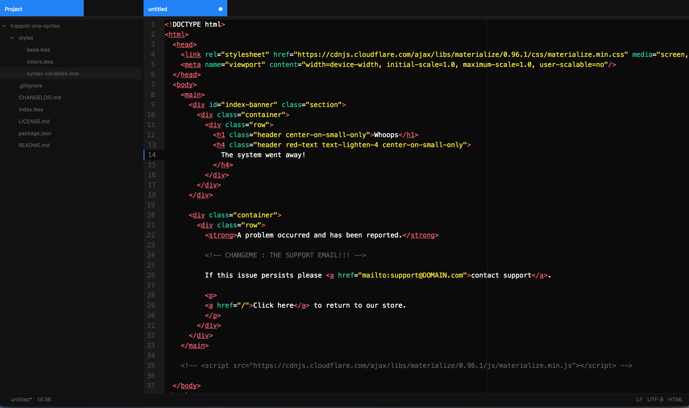
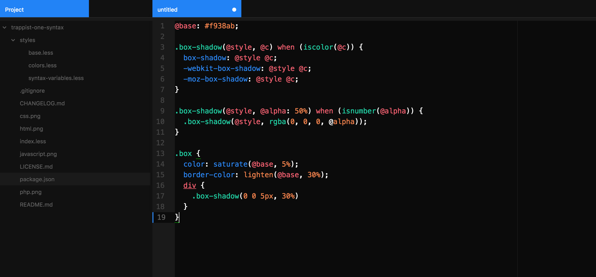
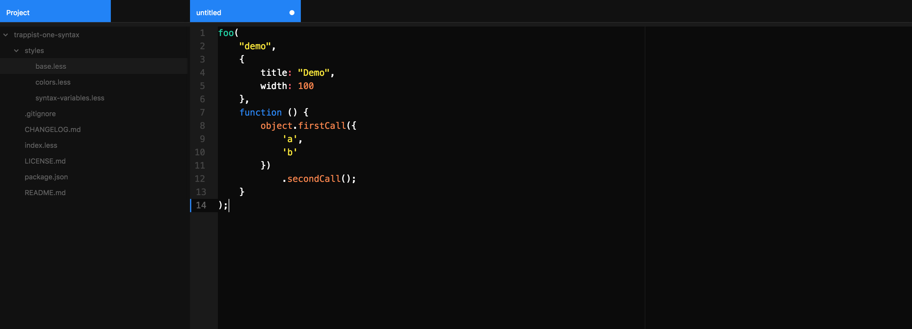
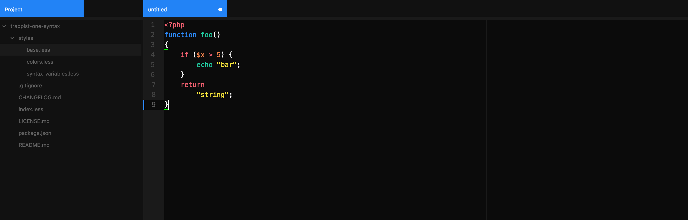

# trappist-one-syntax theme

A dark syntax theme for Atom inspired by Trappist-1

This theme can be activated by going to the Themes section in the Settings view (cmd-,) and selecting it from the UI Themes drop-down menu.

[Link to Trappist-1 UI Theme](https://github.com/craft-tyler/trappist-one-ui)

## HTML

## CSS

## JAVASCRIPT

## PHP

